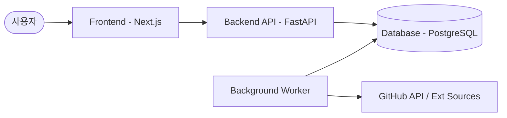

# 🤖 AI Agent Skills Marketplace

> **SKILL.md** 기반 AI 에이전트 스킬 발견, 수집, 큐레이션 및 랭킹 통합 플랫폼

[](https://opensource.org/licenses/MIT)
[](https://www.python.org/downloads/)
[](https://fastapi.tiangolo.com/)
[](https://nextjs.org/)
[](https://www.docker.com/)

AI Agent Skills Marketplace는 전 세계에 흩어진 AI 에이전트 스킬(**SKILL.md**)을 한곳에 모아 관리하는 플랫폼입니다. 자동 수집 파이프라인, 관리자 검토를 통한 핵심 품질 관리, 사용자 활동 기반의 실시간 랭킹 시스템을 제공합니다.

---

## 📋 목차

- [📌 주요 기능](#-주요-기능)
- [🏗️ 시스템 아키텍처](#-시스템-아키텍처)
- [🛠️ 기술 스택](#-기술-스택)
- [🚀 시작하기 (Docker)](#-시작하기-docker)
- [💻 수동 설치 및 개발 설정](#-수동-설치-및-개발-설정)
- [📖 사용 가이드](#-사용-가이드)
- [📚 문서 구조](#-문서-구조)

---

## 📌 주요 기능

### 🔍 스킬 카테고리 및 탐색
- **통합 검색**: 이름, 태그, 설명을 기반으로 한 강력한 검색 기능.
- **필터링 시스템**: 카테고리 및 태그별 세분화된 필터링 제공.
- **실시간 TOP 10**: 일일 활동 데이터를 분석한 글로벌 및 카테고리별 랭킹 노출.

### ⚙️ 자동 수집 파이프라인
- **멀티 소스 크롤링**: GitHub 레포지토리, Awesome List 등 다양한 소스에서 자동 수집.
- **SKILL.md 파싱**: 표준화된 스킬 명세를 분석하여 데이터베이스 최적화 저장.
- **중복 감지**: 유사도 분석을 통한 지능형 중복 스킬 제안.

### 🛡️ 품질 관리 및 큐레이션
- **관리자 콘솔**: 수집된 Raw 데이터를 검토하고 승인하는 전용 인터페이스.
- **미리보기**: 원문 SKILL.md 파일과 파싱된 메타데이터를 실시간 비교 및 확인.
- **승인 워크플로우**: 신규 등록 및 기존 데이터 병합 처리 지원.

---

## 🏗️ 시스템 아키텍처

본 프로젝트는 확장성과 유지보수성을 고려하여 백엔드 API, 백그라운드 워커, 프론트엔드 UI로 분리된 구조를 가집니다.



- **Database Layer**: 비가공 데이터(RawSkills)와 승인된 데이터(Skills)를 분리 관리하여 데이터 품질 유지.
- **Worker System**: 60초 주기로 신규 데이터 수집, 인기 점수 계산, 랭킹 스냅샷 생성을 자동 수행.

---

## 🛠️ 기술 스택

### 백엔드 (API & Worker)
- **Framework**: FastAPI (Python 3.9+)
- **ORM**: SQLAlchemy 2.0 (Async Support), Alembic (Migrations)
- **Security**: JWT Authentication, Python direct `bcrypt` hashing
- **Inference/Parsing**: Pydantic v2, RapidFuzz, BeautifulSoup4

### 프론트엔드
- **Framework**: Next.js 15+ (App Router, TypeScript)
- **Style**: Tailwind CSS
- **API Client**: Axios & Fetch API (Native TS integration)

### 인프라
- **Container**: Docker & Docker Compose
- **Database**: PostgreSQL 15 (Alpine)

---

## 🚀 시작하기 (Docker)

가장 권장되는 실행 방법은 Docker Compose를 사용하는 것입니다.

### 1. 환경 설정
`.env.example` 파일을 복사하여 `.env` 파일을 생성합니다.
```bash
cp .env.example .env
```

### 2. 서비스 실행
```bash
docker compose up --build -d
```

### 3. 서비스 접속
- **Web UI**: [http://localhost:3001](http://localhost:3001)
- **API Docs**: [http://localhost:8000/docs](http://localhost:8000/docs)
- **초기 계정**: `admin` / `admin` (또는 `.env` 설정값)

---

## � 수동 설치 및 개발 설정

### 1. 백엔드 설정
```bash
# 가상환경 생성 및 활성화
python -m venv .venv
source .venv/bin/activate  # Windows: .venv\Scripts\activate

# 의존성 설치
pip install -e .

# 마이그레이션 및 시드 데이터 입력
alembic upgrade head
python -m app.seed
```

### 2. 프론트엔드 설정
```bash
cd web
npm install
npm run dev
```

---

## 📖 사용 가이드

### 관리자 Workflow
1. `/admin/login`을 통해 관리자 계정으로 접속합니다.
2. 수집 큐를 확인하고 새로운 스킬 제안을 검토합니다.
3. 수정이 필요한 항목을 보완하고 '승인' 버튼을 눌러 공용 카탈로그에 게시합니다.

### 사용자 Workflow
1. 홈 화면에서 실시간 **인기 스킬 TOP 10**을 확인합니다.
2. 검색창을 통해 필요한 기능의 자동화 스킬을 찾습니다.
3. 상세 페이지에서 입/출력 가이드를 확인하고 실제 에이전트 환경에 적용합니다.

---

## 📚 문서 구조

- **[PRD.md](docs/PRD.md)**: 제품 요구 사항 정의
- **[TRD.md](docs/TRD.md)**: 기술 사양 및 아키텍처 정의
- **[ERD.md](docs/ERD.md)**: 데이터베이스 개체 관계도
- **[DEVELOPMENT_PLAN.md](docs/DEVELOPMENT_PLAN.md)**: Phase별 구현 상태 관리 로드맵

---

*Built with ❤️ for the AI Agent ecosystem*
