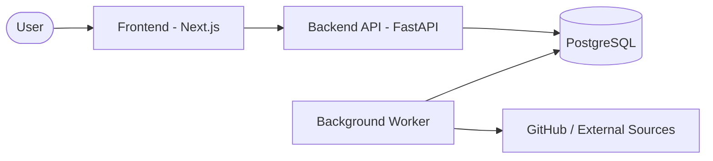

# 🤖 AI Agent Skills Marketplace

> **SKILL.md** 기반 AI 에이전트 스킬 발견, 수집(ingest), 파싱/정합성 검증, 큐레이션 및 랭킹 통합 플랫폼

[](https://opensource.org/licenses/MIT)
[](https://www.python.org/downloads/)
[](https://fastapi.tiangolo.com/)
[](https://nextjs.org/)
[](https://www.docker.com/)
[](https://github.com/coreline-ai/agent_skills_marketplace/actions/workflows/security-scan.yml)
[](https://skills-marketplace-web-3a6p.onrender.com/)

> 🌐 **[라이브 데모 바로가기 →](https://skills-marketplace-web-3a6p.onrender.com/)**

AI Agent Skills Marketplace는 전 세계에 흩어진 **SKILL.md**를 한곳에 모아 관리하는 플랫폼입니다.

- 다양한 소스에서 **스킬을 자동 수집**하고 `raw_skills` 큐에 적재
- Claude Skills 스타일의 **Frontmatter/필드 제약/기본값** 기준으로 파싱 + 정합성 검증 + normalize
- 운영 리스크 없이 `lax -> strict -> enforce`로 **점진적 차단(enforce) 롤아웃**
- 관리자 대시보드에서 **워커 상태(heartbeat)** 및 처리 현황 관측
- 공개 정책에 맞는 스킬만 노출(“공개 스킬”과 “DB 전체” 수가 다를 수 있음)
- 레포 단위 카드 뷰인 **Skill Packs** 제공(`/packs`)

<p float="left">
  
  
</p>

---

## 📋 목차

- [📌 주요 기능](#-주요-기능)
- [🏗️ 시스템 아키텍처](#-시스템-아키텍처)
- [🛠️ 기술 스택](#-기술-스택)
- [🚀 시작하기 (Docker)](#-시작하기-docker)
- [⚙️ 운영/관리 (Admin)](#-운영관리-admin)
- [🔎 상태 확인 (크롤링/파싱)](#-상태-확인-크롤링파싱)
- [💻 수동 설치 및 개발](#-수동-설치-및-개발)
- [🧪 테스트](#-테스트)
- [🔐 보안 노트](#-보안-노트)
- [📚 문서 구조](#-문서-구조)

---

## 📌 주요 기능

### 🔍 스킬 탐색
- 통합 검색(이름/설명/태그)
- 카테고리/태그 필터
- 랭킹(스냅샷 기반) - **모바일 반응형 카드 레이아웃 지원**

### 🧩 플러그인 마켓플레이스 (`/plugins`)
- Claude Code 플러그인 탐색 및 검색
- 카테고리별 필터링
- 외부 마켓플레이스 크롤링 및 동기화

### 📖 사용자 가이드 (`/guide`)
- SKILL.md 작성법 및 베스트 프랙티스
- 스킬 등록 가이드
- 트러블슈팅 FAQ

### ⚙️ 자동 수집 파이프라인
- 멀티 소스 크롤링(디렉토리/레포/코드 검색 등)
- 수집 결과를 `raw_skills`에 적재 후, 워커가 파싱/정규화/검증 수행
- `raw_skills.parse_status`: `pending`, `processed`, `error`

### ✅ SKILL.md 스펙 정합성 검증(점진 롤아웃)
- `profile=lax`: 관측 위주(경고/정규화 중심)
- `profile=strict`: 더 엄격(실패 조건 확대)
- `enforce=ON`: 스펙 실패 시 ingest 결과를 `error`로 떨어뜨려 **차단**

### 🤖 AI 기반 스킬 분석 (GLM-4)
- 스킬 설명 자동 생성 및 요약
- 품질 평가 및 개선 제안
- `app/llm/glm_client.py`: GLM-4-plus API 통합

### 🔒 보안 스캔
- 스킬 콘텐츠 내 잠재적 보안 위험 탐지
- `app/quality/security_scan.py`: 자동화된 보안 검사

### 🗂️ Skill Packs
레포 단위로 스킬을 묶어 보며, "스킬이 개별 디렉토리로 무한히 늘어나는 느낌"을 완화합니다.

---

## 🏗️ 시스템 아키텍처



- `raw_skills`: 외부에서 수집한 원문/메타(큐)
- `skills`: 공개 정책 및 검증을 통과해 노출 가능한 정규화 결과
- 워커는 루프마다 DB에 heartbeat를 기록하고, Admin에서 확인합니다.

---

## 🛠️ 기술 스택

### Backend
- **Python 3.10+** / FastAPI 0.115+ / SQLAlchemy(Async) / Alembic
- Pydantic v2 (입력값 길이 제한 등 강화된 검증) / PyYAML / httpx
- JWT (4시간 만료) + bcrypt(passlib)
- 관리자 감사 로그 (Audit Logging)

### Frontend
- Next.js(App Router) + TypeScript
- Tailwind CSS

### Infra
- Docker Compose (이미지 태그 고정: `python:3.11.10-slim`, `node:20.18.0-slim`)
- PostgreSQL 15
- 비루트(non-root) 컨테이너 실행

---

## 🚀 시작하기 (Docker)

### 1) 환경 파일 생성

```bash
cp .env.example .env
```

`.env.example`에 모든 설정 항목과 설명이 포함되어 있습니다. 주요 설정:

| 변수 | 설명 | 필수 |
|------|------|------|
| `ENV` | `development` / `production` (기본: `production`) | ✅ |
| `DATABASE_URL` | PostgreSQL 접속 URL | ✅ |
| `ADMIN_USERNAME` | 관리자 계정 | ✅ |
| `ADMIN_PASSWORD_HASH` | bcrypt 해시된 비밀번호 | ✅ |
| `JWT_SECRET_KEY` | JWT 시크릿 (운영 시 반드시 변경) | ✅ |
| `GITHUB_TOKEN` | GitHub API 토큰 (rate limit 완화) | 권장 |
| `CORS_ORIGINS` | 허용 Origin 목록 (쉼표 구분) | ✅ |
| `GLM_API_KEY` | AI 요약 생성용 API 키 | 선택 |

> ⚠️ **프로덕션 환경에서는 `ENV=production`으로 설정하세요.** Swagger/ReDoc 문서가 자동으로 비활성화됩니다.

### 2) 서비스 실행

```bash
docker-compose up --build -d
# If you have the Docker Compose plugin, you can also use: docker compose up --build -d
```

### 3) 마이그레이션/시드 (최초 1회)

```bash
docker exec -it skills_marketplace_api alembic upgrade head
docker exec -it skills_marketplace_api python -m app.seed
```

### 4) 접속
- Web UI: `http://localhost:3004`
- API Docs: `http://localhost:8000/docs` (개발 환경에서만 접근 가능)
- DB(host 접근): `localhost:5433` (컨테이너 내부는 `db:5432`)

---

## ⚙️ 운영/관리 (Admin)

### 주요 화면
- 로그인: `http://localhost:3004/admin/login`
- 대시보드: `http://localhost:3004/admin/dashboard`
- 플러그인 관리: `http://localhost:3004/admin/crawling`
- Raw Queue: `http://localhost:3004/admin/skills` (pending/processed/error 탭)
- Quality Errors: `http://localhost:3004/admin/quality`

### 공개 페이지
| 경로 | 설명 |
|------|------|
| `/` | 랜딩 페이지 (호버 비디오 효과) |
| `/skills` | 스킬 라이브러리 |
| `/rankings` | 스킬 랭킹 (모바일 반응형) |
| `/plugins` | 플러그인 마켓플레이스 |
| `/packs` | Skill Packs (레포 단위 뷰) |
| `/guide` | 사용자 가이드 |

### 워커 동작 개념
- **auto ingest ON**: `ingest -> parse/validate -> compute_popularity -> build_rank_snapshots`
- **auto ingest OFF**: 크롤링(수집)은 멈추지만, `pending` 파싱 큐는 드레인할 수 있습니다.

### 공개(노출) 정책
“공개 스킬”은 아래 URL 패턴만 대상으로 합니다. 그래서 `DB 전체`와 수가 다를 수 있습니다.
- `https://github.com/<owner>/<repo>/blob/<ref>/skills/<id>/SKILL.md`
- `https://github.com/<owner>/<repo>/blob/<ref>/.claude/skills/<id>/SKILL.md`

---

## ☁️ Render.com 배포

이 프로젝트는 Render.com을 통한 원클릭 배포를 지원합니다.

### 구성 요소 (`render.yaml`)
| 서비스 | 유형 | 설명 |
|--------|------|------|
| `skills-marketplace-api` | Web Service | FastAPI 백엔드 |
| `skills-marketplace-worker` | Background Worker | 크롤링/파싱 워커 |
| `skills-marketplace-web` | Web Service | Next.js 프론트엔드 |

### 배포 방법
1. Render.com에 GitHub 레포 연결
2. "New Blueprint" 선택 후 `render.yaml` 자동 감지
3. 환경 변수 설정 (DATABASE_URL, SECRET_KEY 등)
4. 배포 시작

> **참고**: Free tier에서도 모든 서비스 실행 가능합니다.

---

## 🔎 상태 확인 (크롤링/파싱)

### 1) 컨테이너 상태/로그

```bash
docker-compose ps
docker logs -f skills_marketplace_worker
docker logs -f skills_marketplace_api
docker logs -f skills_marketplace_web
```

### 2) Admin에서 “워커가 지금 뭐 하는지” 보기

대시보드의 **워커 상태(worker-status)** 는 워커가 루프마다 DB에 남기는 heartbeat입니다.

- `phase`: `sleep`이면 “할 일 다 하고 다음 루프 대기 중”입니다.
- `interval`: 루프 간격(초)입니다. 기본 60초.
- `pending: A -> B`: 이번 루프 시작 시점 큐(A)에서 종료 시점 큐(B)로 얼마나 줄었는지입니다.
- `processed_in_loop / errors_in_loop`: 이번 루프에서 실제로 파싱/검증 처리한 개수입니다.
- `recent events`: 이번 루프에서 실제 실행된 단계 로그입니다. (예: `parse_batch`, `compute_popularity` 등)

`pending=0`인 상태가 “정상”일 수 있습니다.
- 큐가 비어 있으면(=처리할 raw가 없으면) 매 루프에 처리량 변화가 거의 없습니다.
- `auto ingest OFF` 상태에서는 “새로 수집”을 하지 않기 때문에, 이미 쌓인 `pending`만 드레인하고 나면 0으로 유지됩니다.

### Skill Packs
- 목록: `http://localhost:3004/packs`
- 상세: `http://localhost:3004/packs/<pack_id>`

---

## 💻 수동 설치 및 개발

### Backend

```bash
python3 -m venv .venv
source .venv/bin/activate
pip install -e ".[dev]"

alembic upgrade head
python -m app.seed

uvicorn app.main:app --host 0.0.0.0 --port 8000 --reload
```

### Frontend

```bash
cd web
npm install
npm run dev
```

---

## 🧪 테스트

```bash
docker exec -it skills_marketplace_api pytest -q
```

---

## 🔐 보안 노트

본 프로젝트는 다층적 보안 체계를 적용하고 있습니다. 자세한 내용은 [SECURITY.md](SECURITY.md)를 참고하세요.

### 적용된 보안 조치

| 영역 | 조치 | 상태 |
|------|------|------|
| 🐳 Docker | 비루트(non-root) 사용자로 컨테이너 실행 | ✅ |
| 🐳 Docker | 이미지 태그 특정 버전 고정 | ✅ |
| 🔑 인증 | JWT 만료 시간 4시간 (기존 24시간) | ✅ |
| 🛡️ 입력 검증 | Pydantic `max_length` 등 제약 조건 추가 | ✅ |
| 📋 감사 로그 | 관리자 로그인/수집/설정 변경 기록 | ✅ |
| 📖 API 문서 | 프로덕션 환경 Swagger/ReDoc 비활성화 | ✅ |
| 🔍 자동 스캔 | GitHub Actions를 통한 `pip-audit` / `npm audit` | ✅ |
| 🔒 비밀번호 | 로그에 민감 정보 미기록 확인 | ✅ |
| 📦 의존성 | 취약 패키지 최신 보안 버전으로 업그레이드 | ✅ |

### 주의사항
- `.env`, `.cursor/`, `.vscode/` 같은 로컬 설정/시크릿 파일은 레포에 커밋하지 마세요.
- 과거 커밋에 API 키/토큰이 포함되었다면, 파일을 삭제했더라도 **키는 회수/재발급(rotate)** 하는 것이 안전합니다.

---

## 📚 문서 구조

- `docs/PRD.md`: 제품 요구 사항 정의
- `docs/TRD.md`: 기술 사양 및 아키텍처 정의
- `docs/ERD.md`: 데이터베이스 개체 관계도
- `docs/DEVELOPMENT_PLAN.md`: Phase별 구현 상태 관리 로드맵

---

Built for the AI Agent ecosystem.
Coreline AI MIT License
