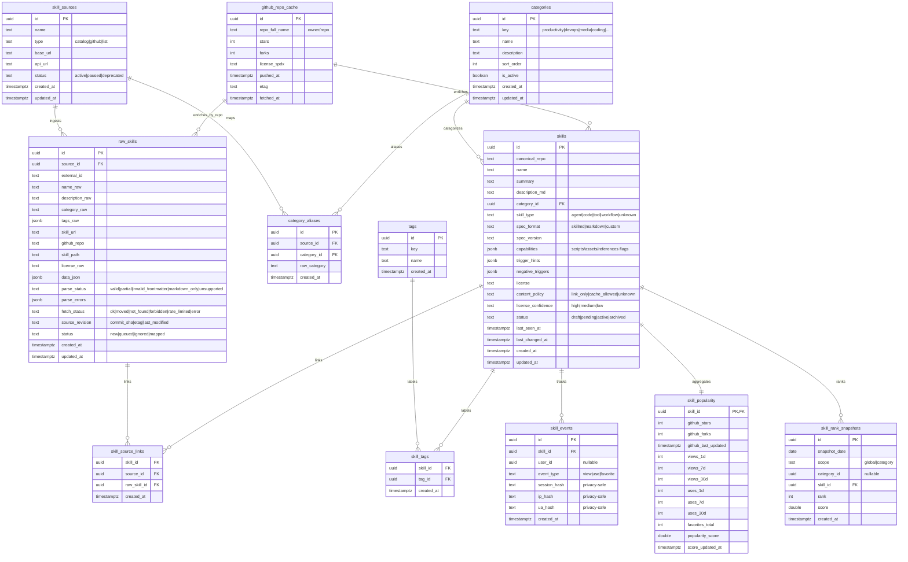

# ERD.md — AI Agent Skills Marketplace (v1.0)

> 목적: SKILL.md 기반 스킬 카탈로그/마켓플레이스의 핵심 데이터 모델과 관계(ERD)를 한 눈에 정리한다.
> 주의: 이 문서는 **그대로 저장**해서 사용 가능하다. (코드블럭 깨짐 방지 위해 바깥 펜스는 `~~~` 사용)

---

## 1) ERD (Mermaid)

---

## 2) 관계 요약

- **skill_sources → raw_skills (1:N)**  
  여러 외부 소스로부터 크롤링된 원본 스킬을 저장한다.

- **raw_skills ↔ skills (N:1 / N:N via skill_source_links)**  
  하나의 정식 스킬(skills)이 여러 원본(raw_skills)과 매핑될 수 있다. (중복 합치기)

- **skills ↔ tags (N:N via skill_tags)**  
  태그는 정규화 테이블로 관리한다.

- **categories → skills (1:N)**  
  내부 공통 카테고리로 정규화한다.

- **skill_sources + category_aliases**  
  소스별 카테고리 문자열을 내부 categories로 매핑한다.

- **skills → skill_events (1:N)**  
  조회/사용/즐겨찾기 이벤트 로그.

- **skills → skill_popularity (1:1)**  
  이벤트/외부 지표를 집계해 스킬별 점수 저장.

- **skills → skill_rank_snapshots (1:N)**  
  “오늘의 TOP10” 안정화를 위한 스냅샷.

- **github_repo_cache → (raw_skills, skills)**  
  GitHub API 호출 결과(별/포크/라이선스/최근 업데이트)를 레이트리밋/비용 관점에서 캐시한다.

---

## 3) 핵심 제약조건(권장)

### 3.1 raw_skills 중복 방지
- UNIQUE(source_id, external_id)
- UNIQUE(source_id, skill_url)

### 3.2 skill_source_links 유일성
- PRIMARY KEY(skill_id, source_id, raw_skill_id)
- 또는 UNIQUE(skill_id, raw_skill_id)

### 3.3 tags/categories 정규화
- UNIQUE(tags.key)
- UNIQUE(categories.key)
- UNIQUE(category_aliases.source_id, category_aliases.raw_category)

### 3.4 이벤트 집계 품질(어뷰징 방지 최소)
- skill_events에 session_hash/ip_hash/ua_hash 저장(개인정보 최소화)
- 집계 시 동일 세션 반복 제외(예: 5분 내 동일 이벤트 제외)

---

## 4) MVP에서 “필수” 테이블 최소 세트

- skill_sources
- raw_skills
- skills
- skill_source_links
- categories (+ category_aliases 권장)
- tags + skill_tags
- skill_events
- skill_popularity
- skill_rank_snapshots (TOP10 고정 필요하면 강력 권장)
- github_repo_cache (GitHub API 쓰면 강력 권장)

---

## 5) 확장 포인트(선택)

- skill_revisions: SKILL.md 변경 이력 저장(운영/신뢰도 강화)
- repo_blocklist/author_blocklist: 스팸/악성 유입 차단
- quality_flags: 자동 품질 플래그(설명 빈약, 중복 의심 등)
- i18n: skills_translations(ko/en/ja)로 다국어 변종 묶기

---
